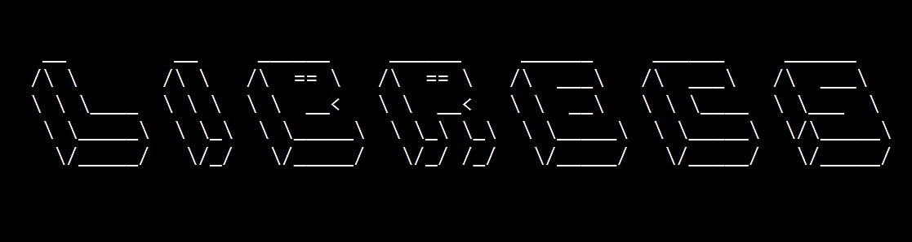

# LibreCS

### Developing open-source solutions with enterprise level performance and reliability

We develop open-source software tools and systems to bring enterprise features, performance, and reliability to professionals and enthusiasts by pursuing projects inclusive to low resource environments and non-standard process architectures.

### Future Projects
- pitify - Remote connect Spotify daemon for full-time audio control using Raspberry Pi
- plcd - Lightweight program to monitor and log PLC (Programmable Logic Controller) uptime remotely
- vqgarm - VQGAN + CLIP implementation for testing arm64 processors

### Use and Contribution

All of our software is licensed under the GNU GPLv3, and we encourage its use in other open-source projects. Contributions are greatly appreciated, and no reasonable pull request will be denied without an explanation on our end. 